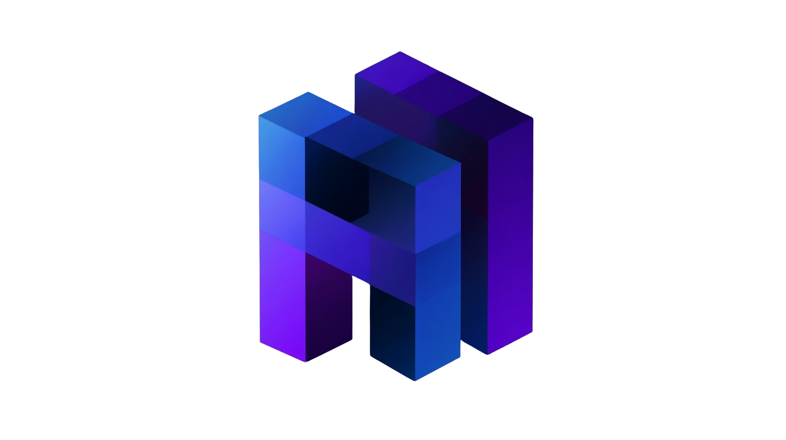
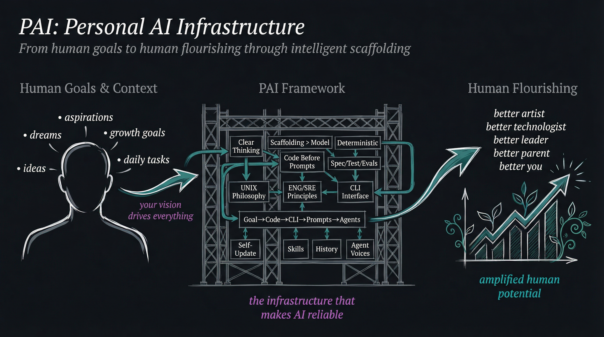

<div align="center">

<picture>
  <source media="(prefers-color-scheme: dark)" srcset="./pai-logo.png">
  <source media="(prefers-color-scheme: light)" srcset="./pai-logo.png">
  
</picture>

# **Personal AI Infrastructure** (PAI)

### **Open-source personal AI infrastructure for orchestrating your life and work**

<br/>


[](https://opensource.org/licenses/MIT)
[](https://claude.ai/code)
[](https://youtu.be/iKwRWwabkEc)

[**Quick Start**](#-quick-start) · [**Documentation**](#-documentation) · [**Examples**](#-examples) · [**Updating**](#-updating-pai) · [**Community**](#-community)]

<br/>

[](https://youtu.be/iKwRWwabkEc)

**[Watch the full PAI walkthrough](https://youtu.be/iKwRWwabkEc)** | **[Read: The Real Internet of Things](https://danielmiessler.com/blog/real-internet-of-things)**

---

# The best AI in the world should be available to everyone

<picture>
  <source media="(prefers-color-scheme: dark)" srcset="docs/images/pai-overview.png">
  <source media="(prefers-color-scheme: light)" srcset="docs/images/pai-overview.png">
  
</picture>

</div>

---

## 🎯 **What is PAI?**

**Philosophy:** Bringing AI to everyone. Democratizing personal AI infrastructure so anyone can build their own intelligent operating system.

PAI (Personal AI Infrastructure) is a template for building your own AI-powered operating system using Claude Code.

**Core Primitives:**
- **Skills** - Self-contained AI capabilities with routing, workflows, and documentation
- **Agents** - Specialized AI personalities for different tasks (engineer, researcher, designer, etc.)
- **Hooks** - Event-driven automation that captures work, provides voice feedback, and manages state

**Approach:** Start clean, small, and simple. Build the scaffolding that makes AI reliable.

---

## 🔄 **PAI vs Kai: What You Get**

**PAI (this repository) provides:**
- ✅ Skills/agents/hooks architecture
- ✅ CORE documentation and routing
- ✅ History system (UOCS) for automatic documentation
- ✅ Example skills (research, fabric, etc.)
- ✅ Voice server skeleton
- ⚙️ **Requires:** API key configuration per skill

**Kai (Daniel's private system) adds:**
- 🔒 Personal data, contacts, and history
- 🔒 Additional private skills and workflows
- 🔒 Customized agent personalities and voices
- 🔒 Production integrations and automations

**Think of it this way:** PAI is the scaffolding. You build your own "Kai" on top of it.

**After setup, PAI should:**
- ✅ Execute hooks without errors
- ✅ Load CORE context at session start
- ✅ Route skills correctly
- ✅ Capture session history
- ✅ Launch agents successfully

**Not working?** Run the health check:
```bash
bun ~/.claude/hooks/self-test.ts
```

See `PAI_CONTRACT.md` for complete details on what's guaranteed vs what needs configuration.

---

## 🚀 **Quick Start**

### 1. Install Prerequisites

```bash
# Install Bun (PAI's package manager)
curl -fsSL https://bun.sh/install | bash

# Install Claude Code
# Follow instructions at: https://code.claude.com
```

### 2. Clone and Configure

```bash
# Clone the repository
git clone https://github.com/danielmiessler/Personal_AI_Infrastructure.git
cd Personal_AI_Infrastructure

# Copy environment template
cp .claude/.env.example .claude/.env

# Edit .env and add your API keys
# At minimum: ANTHROPIC_API_KEY=your_key_here
```

### 3. Copy to Your System

```bash
# Copy .claude directory to your home directory
cp -r .claude ~/.claude

# Or symlink if you prefer
ln -s $(pwd)/.claude ~/.claude
```

### 4. Start Claude Code

```bash
# PAI loads automatically via the CORE skill
claude-code
```

**That's it!** The CORE skill loads at session start and provides all PAI functionality.

📚 **For detailed setup:** See `docs/QUICKSTART.md`

---

## 📚 **Documentation**

**All documentation lives in the CORE skill** (`.claude/skills/CORE/`):

### **Essential Reading**

- **[CONSTITUTION.md](.claude/skills/CORE/CONSTITUTION.md)** - System philosophy, architecture, and operating principles
- **[SKILL.md](.claude/skills/CORE/SKILL.md)** - Main PAI skill with identity, preferences, and quick reference
- **[SKILL-STRUCTURE-AND-ROUTING.md](.claude/skills/CORE/SKILL-STRUCTURE-AND-ROUTING.md)** - How to create your own skills

### **System Guides**

- **[hook-system.md](.claude/skills/CORE/hook-system.md)** - Event-driven automation
- **[history-system.md](.claude/skills/CORE/history-system.md)** - Automatic work documentation
- **[VOICE.md](.claude/skills/CORE/VOICE.md)** → **[voice-server/README.md](.claude/voice-server/README.md)** - Text-to-speech feedback

### **Reference**

- **[prosody-guide.md](.claude/skills/CORE/prosody-guide.md)** - Voice emotion system
- **[prompting.md](.claude/skills/CORE/prompting.md)** - Prompt engineering patterns
- **[terminal-tabs.md](.claude/skills/CORE/terminal-tabs.md)** - Terminal management

---

## 🎨 **Examples**

Explore example skills in `.claude/skills/`:

- **`brightdata/`** - Four-tier progressive web scraping with automatic fallback (WebFetch → cURL → Playwright → Bright Data MCP)
- **`fabric/`** - Integration with Fabric pattern system (242+ AI patterns)
- **`research/`** - Multi-source research workflows
- **`create-skill/`** - Templates for creating new skills
- **`alex-hormozi-pitch/`** - Business pitch generation
- **`ffuf/`** - Web fuzzing and security testing

Each skill demonstrates the skills-as-containers pattern with routing, workflows, and self-contained documentation.

---

## 🏗️ **Architecture**

PAI is built on three foundational principles:

### **1. Command Line First**
Build deterministic CLI tools, then wrap them with AI orchestration. Code is cheaper, faster, and more reliable than prompts.

### **2. Skills as Containers**
Package domain expertise in self-activating, self-contained modules. Natural language triggers automatic routing to the right skill.

### **3. Progressive Disclosure**
Load context only when needed (3 tiers):
- **Tier 1:** System prompt (always active, 200-500 words)
- **Tier 2:** SKILL.md (on-demand, comprehensive reference)
- **Tier 3:** Reference files (just-in-time, deep dives)

**Complete architecture:** See `.claude/skills/CORE/CONSTITUTION.md`

---

## 🛠️ **Technology Stack**

- **Runtime:** Bun (NOT Node.js)
- **Language:** TypeScript (NOT Python - we're TypeScript zealots)
- **Package Manager:** Bun (NOT npm/yarn/pnpm)
- **Format:** Markdown (NOT HTML for basic content)
- **Testing:** Vitest when needed
- **Voice:** ElevenLabs TTS integration

---

## 🔐 **Security**

**IMPORTANT:** This is a PUBLIC template repository with sanitized examples.

**DO NOT commit:**
- API keys or secrets
- Personal email addresses or contact information
- Private repository references
- Any sensitive personal data

See `SECURITY.md` for complete security protocols.

---

## 💬 **Community**

- **GitHub Issues:** [Report bugs or request features](https://github.com/danielmiessler/Personal_AI_Infrastructure/issues)
- **Discussions:** [Ask questions and share ideas](https://github.com/danielmiessler/Personal_AI_Infrastructure/discussions)
- **Video:** [Watch PAI Overview](https://youtu.be/iKwRWwabkEc)

---

## 📜 **License**

MIT License - see `LICENSE` file for details.

---

## 🙏 **Acknowledgments**

Built on [Claude Code](https://code.claude.com) by Anthropic.

Inspired by the idea that AI systems need scaffolding to be reliable. This is that scaffolding.

---

<div align="center">

**Start clean. Start small. Build the AI infrastructure you need.**

[⬆ Back to Top](#personal-ai-infrastructure-pai)

</div>
